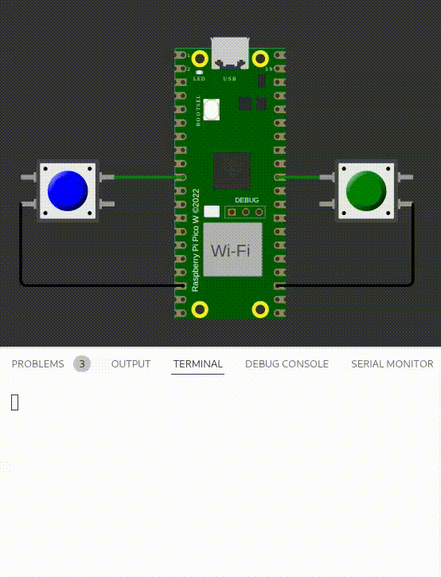

# exe 5

Bouncing é um problema encontarado em botões mecânicos, um botão pode ser entendido como um sistema massa mola, que quando apertado vibra e pelo microcontrolador ser muito rápido, ele interpreta isso como várias apertadas.

#### Código

Imprima via printf quantas vezes o botão foi apertado, implemente um código de **debouncing** que filtra a vibracão do botão.

- Teste: Aperta um dos botões e contar apenas uma vez!

#### Funcionalidade esperada

