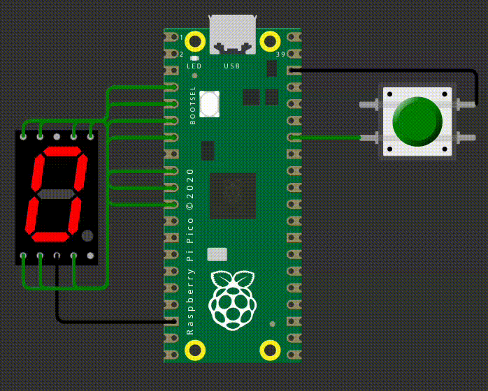

# EXE1

Este código controla o display de 7 segementos e a cada vez que você apertar o botão ele vai incrementar um contador e exibir no display, o código já funciona corretamente, mas possui erros de qualidade de código. Você deve corrigir eles nessa entrega, sem alterar o comportamento do programa.